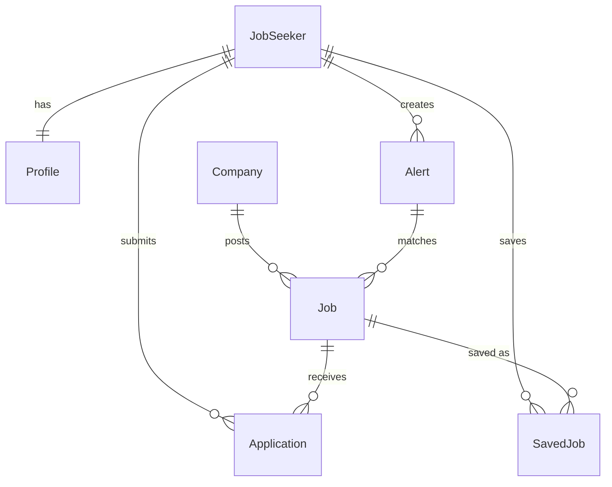
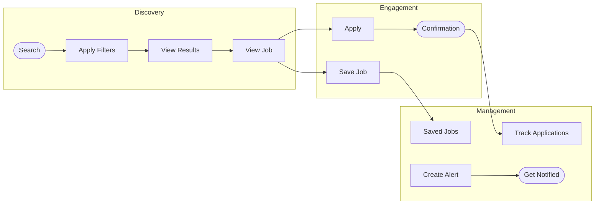
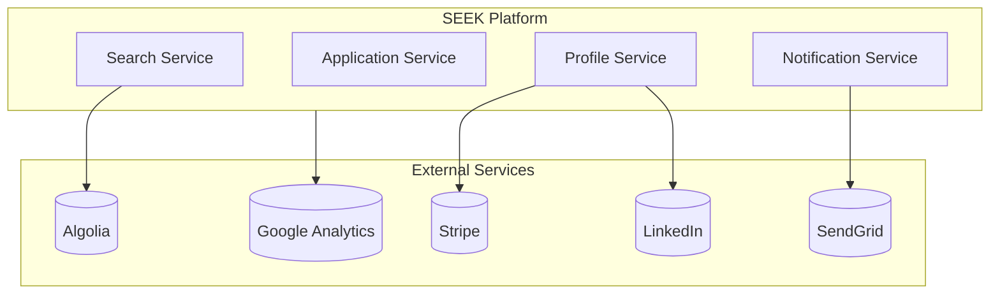

# Example Output: Product Context

This is an example of the output format for a job marketplace product.

---

# Product Context: SEEK Career Marketplace

Generated: 2026-01-13T10:30:00Z
Source: github.com/seek/career-platform

## Existing Documentation

Found in `.cursor/rules.md`:
- Design system tokens and component usage
- API naming conventions

Found in `docs/`:
- API documentation (technical)
- No product specs found

Found in `README.md`:
- Basic setup instructions only

**Gap identified**: No formal PRDs or product specs in repository.

## System Overview

### Entity Model



### Core User Journeys



### Integration Context



## Capabilities

### Job Search & Discovery
- **What**: Users can search jobs by keyword, location, salary, and filters
- **Where**: `src/features/search/`, `/api/jobs/search`
- **Constraints**: Search limited to 1000 results, location radius max 100km

### Job Application
- **What**: Users apply to jobs with profile or uploaded resume
- **Where**: `src/features/apply/`, `/api/applications`
- **Constraints**: Max 50 applications per day (rate limited)

### Profile Management
- **What**: Users maintain career profile with work history, skills, preferences
- **Where**: `src/features/profile/`, `/api/profile`
- **Constraints**: Skills limited to predefined taxonomy (no free text)

### Saved Jobs & Alerts
- **What**: Users save jobs and create alerts for new matches
- **Where**: `src/features/saved/`, `/api/alerts`
- **Constraints**: Max 100 saved jobs, 10 active alerts

## Core Entities

### JobSeeker
- **Purpose**: Registered user looking for employment
- **Attributes**: profile, preferences, applications[], savedJobs[]
- **Relationships**: Has many Applications, has one Profile

### Job
- **Purpose**: Employment opportunity posted by employer
- **Attributes**: title, description, salary, location, requirements[]
- **Relationships**: Belongs to Company, has many Applications

### Application
- **Purpose**: Expression of interest from seeker to job
- **Attributes**: status, appliedAt, resume, coverLetter
- **Relationships**: Belongs to JobSeeker, belongs to Job

### Company
- **Purpose**: Employer posting jobs
- **Attributes**: name, logo, description, jobs[]
- **Relationships**: Has many Jobs

## Key Types

Types that specs should reference:

```typescript
// From src/types/job.ts
type JobStatus = 'active' | 'expired' | 'filled' | 'draft'

type SalaryRange = {
  min: number
  max: number
  currency: 'AUD' | 'NZD'
  period: 'annual' | 'hourly'
}

// From src/types/application.ts
type ApplicationStatus = 
  | 'submitted' 
  | 'viewed' 
  | 'shortlisted' 
  | 'rejected' 
  | 'withdrawn'

// From src/types/user.ts
type UserPreferences = {
  jobTypes: JobType[]
  locations: Location[]
  salaryMin: number
  remoteOnly: boolean
  alertFrequency: 'daily' | 'weekly' | 'instant'
}
```

## Component Inventory

Existing UI components available for reuse:

| Component | Location | Purpose | Extensible? |
|-----------|----------|---------|-------------|
| JobCard | `src/components/job-card.tsx` | Display job listing in feed | Yes |
| SearchFilters | `src/components/search-filters.tsx` | Filter controls for search | Yes |
| ApplicationForm | `src/components/application-form.tsx` | Multi-step apply flow | Limited |
| ProfileEditor | `src/components/profile-editor.tsx` | Edit user profile sections | Yes |
| AlertBanner | `src/components/alert-banner.tsx` | System notifications | Yes |
| SaveButton | `src/components/save-button.tsx` | Save/unsave job toggle | Yes |
| SalaryDisplay | `src/components/salary-display.tsx` | Format salary ranges | Yes |
| CompanyLogo | `src/components/company-logo.tsx` | Company branding with fallback | Yes |

**Patterns observed:**
- Cards use consistent padding/shadow via design system
- Forms use react-hook-form + zod validation
- Modals use Radix Dialog primitives

## State Patterns

How state is managed:

- **Global state**: React Context for auth (`AuthProvider`), feature flags (`FeatureFlagProvider`)
- **Server state**: React Query for API data, 5min stale time default
- **Form state**: react-hook-form with zod schemas
- **Persistence**: 
  - `localStorage.seekerPrefs` — search preferences
  - `localStorage.recentSearches` — last 10 searches
  - `sessionStorage.draftApplication` — in-progress application

**Key providers** (wrap app in `app/layout.tsx`):
```
AuthProvider > FeatureFlagProvider > QueryClientProvider > ThemeProvider
```

## Integration Points

| System | Purpose | Constraints |
|--------|---------|-------------|
| Algolia | Search indexing | 10k ops/day on current plan |
| SendGrid | Email notifications | Rate limits on alerts |
| Stripe | Premium subscriptions | AU/NZ only |
| LinkedIn | Profile import | OAuth refresh every 60 days |
| Google Analytics | Usage tracking | PII restrictions |

## Product Constraints

- **Skill taxonomy is closed**: Users can only select from ~500 predefined skills. Adding new skills requires taxonomy review. This affects personalization accuracy for emerging roles.

- **Location is AU/NZ only**: Address validation, salary ranges, and employer verification all assume AU/NZ. International expansion requires significant refactoring.

- **Application rate limiting**: 50/day limit is hardcoded. This protects employers but frustrates active seekers. No employer-side controls.

- **No real-time messaging**: All communication is async via email. No in-app chat despite `TODO: add messaging` comments throughout.

## Open Questions

- [ ] What's the business rationale for 50 applications/day limit?
- [ ] Is the skill taxonomy maintained? When was it last updated?
- [ ] Are there plans for international expansion?
- [ ] Why is messaging not implemented despite TODO markers?
- [ ] What defines a "premium" user? Found references but no clear definition.

## Discovery Opportunities

### Outcomes to Explore

**Increase application-to-interview rate**
- Current: Unknown (no tracking found)
- Capability exists to track but isn't measured
- Files: `src/analytics/events.ts` has placeholder

**Reduce time-to-apply**
- Evidence: Complex multi-step flow in `src/features/apply/`
- Opportunity: Quick apply with saved profile

### Assumptions to Test

**"Users want to apply to many jobs"**
- Evidence: 50/day limit, bulk actions
- Counter-evidence: Quality matching might reduce need
- Test: Do power users hit limits? What's distribution?

**"Skills taxonomy covers user needs"**
- Evidence: Predefined list in `src/data/skills.json`
- Risk: Last updated 2024, missing AI/ML roles
- Test: Free-text search queries that don't match taxonomy

### Opportunities

**Gap: No application status visibility**
- Users apply but can't see employer response
- `Application.status` exists but not exposed in UI
- Job: "I want to know if I'm being considered so I can plan my search"

**Gap: Preferences don't influence search ranking**
- Profile preferences stored but search doesn't use them
- Files: `src/features/search/ranking.ts` has TODO
- Job: "I want relevant jobs surfaced automatically"

**Gap: No way to decline/withdraw applications**
- Users can apply but can't undo
- Evidence: Support tickets (mentioned in comments)
- Job: "I want to manage my active applications"
