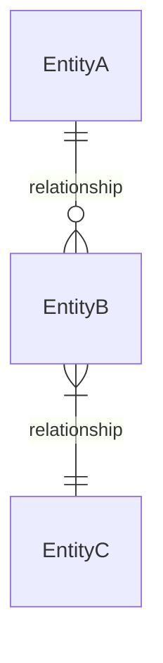
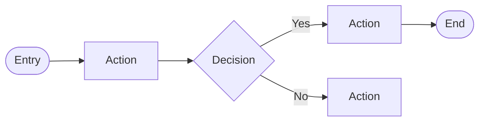
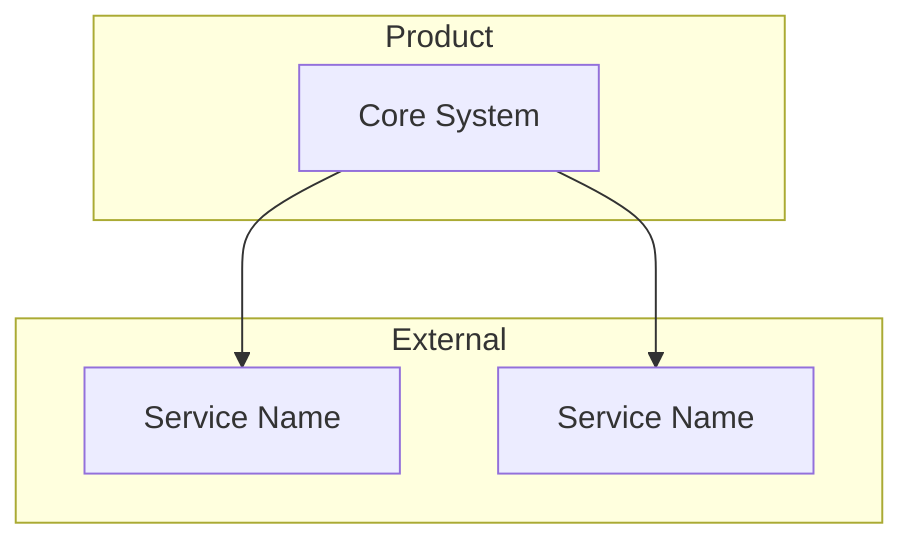

# Product Context Skill

Generate a PM-readable understanding of a codebase to enable better product discovery and spec writing.

## Purpose

Create the semantic layer between engineering artifacts and product decision-making. Extract what PMs need—not architecture diagrams, but capabilities, entities, constraints, and context for product decisions.

## Workflow

### 1. Scan for Existing Context

Check for existing product artifacts first:

```
.sentiuma/          # Sentiuma plans and specs
.cursor/            # Cursor rules and context  
.claude/            # Claude project files
docs/               # Documentation folder
README.md           # Project readme
PRODUCT.md          # Product documentation
*.md in root        # Any markdown files
```

Extract: specs, PRDs, user stories, business rules, decision records (ADRs).

### 2. Analyze Codebase

Scan for:

**Capabilities** — Routes/endpoints mapping to user actions, UI components, feature flags, permissions

**Entities** — Database models, API resources, domain objects, relationships

**Integrations** — External APIs, auth providers, payments, analytics

**Constraints** — Hardcoded rules, TODO/FIXME markers, performance limits, security boundaries

**Component Inventory** — Existing UI components that can be extended or reused:
- Scan `src/components/` for reusable components
- Note which are page-specific vs shared
- Identify component patterns (cards, modals, forms, players)
- Flag components with TODO/WIP markers

**State Management Patterns** — How the app manages state:
- Global state: Context providers, Zustand stores, Redux
- Server state: React Query, SWR, Server Components
- Local state: useState, useReducer patterns
- Persistence: localStorage, sessionStorage usage

**Key Type Definitions** — Types that specs should reference:
- Scan `src/types/`, `src/models/`, `*.d.ts` files
- Extract domain types (User, Article, etc.)
- Note shared types vs feature-specific types
- Include enum values that constrain behavior

### 3. Generate Mermaid Diagrams

Create visual representations to aid understanding:

**Entity Relationship Diagram** (from models/schemas)

- Extract from: database models, TypeScript types, API schemas
- Show: core entities, relationships, cardinality
- Omit: audit fields, internal IDs, technical metadata

**User Journey Flowchart** (from routes/UI)

- Extract from: route definitions, UI components, navigation
- Show: main user paths, decision points, outcomes
- Focus: happy path + key alternative flows

**Integration Context Diagram** (from external calls)

- Extract from: API clients, SDK imports, env variables
- Show: external dependencies, data flow direction
- Note: which are critical vs optional

### 4. Generate Output

Create `.sentiuma/plans/product-context.md`:

````markdown
# Product Context: [Product Name]

Generated: [timestamp]
Source: [repo path]

## Existing Documentation
[Summary of specs/PRDs found]

## System Overview

### Entity Model
```mermaid
erDiagram
    [Generated from models/schemas]
````

### Core User Journeys
```mermaid
flowchart LR
    [Generated from routes/UI flows]
```

### Integration Context
```mermaid
flowchart TB
    [Generated from external dependencies]
```

## Capabilities
What users can do:

\#\## [Area]
- **What**: [description]
- **Where**: [files/routes]
- **Constraints**: [limits]

## Core Entities
Main objects in the system:

\#\## [Entity]
- **Purpose**: [what it represents]
- **Attributes**: [key fields]
- **Relationships**: [connections]

## Key Types
Types that specs should reference:

```typescript
// From src/types/ or src/models/
type EntityName = {
  field: type
}
```

## Component Inventory
Existing UI components available for reuse:

| Component | Location | Purpose        | Extensible? |
| --------- | -------- | -------------- | ----------- |
| [name]    | [path]   | [what it does] | [yes/no]    |

## State Patterns
How state is managed:

- **Global state**: [Context/Zustand/Redux pattern used]
- **Server state**: [React Query/SWR/Server Components]
- **Persistence**: [localStorage keys, what's persisted]

## Integration Points
| System | Purpose | Constraints |
|--------|---------|-------------|

## Product Constraints
Hard-to-change assumptions:
- **[Constraint]**: [why it matters for product]

## Open Questions
- [ ] [Needs human clarification]

## Discovery Opportunities

### Outcomes to Explore
[Based on capabilities]

### Assumptions to Test  


### Opportunities
[Gaps identified]
````

### 5. Directory Setup

```bash
mkdir -p .sentiuma/plans
````

Output to `.sentiuma/plans/product-context.md`. Timestamp if exists.

## Guidelines

- Write for PMs, not engineers
- Focus on "what users can do" not "how code works"
- Highlight constraints affecting product decisions
- Flag assumptions needing validation
- Include file paths for engineer handoff
- Keep scannable—tables and lists for reference

## Framework

Uses Continuous Discovery Habits (Teresa Torres), JTBD, Testing Business Ideas.

See `references/discovery-framework.md` for detailed guidance.
